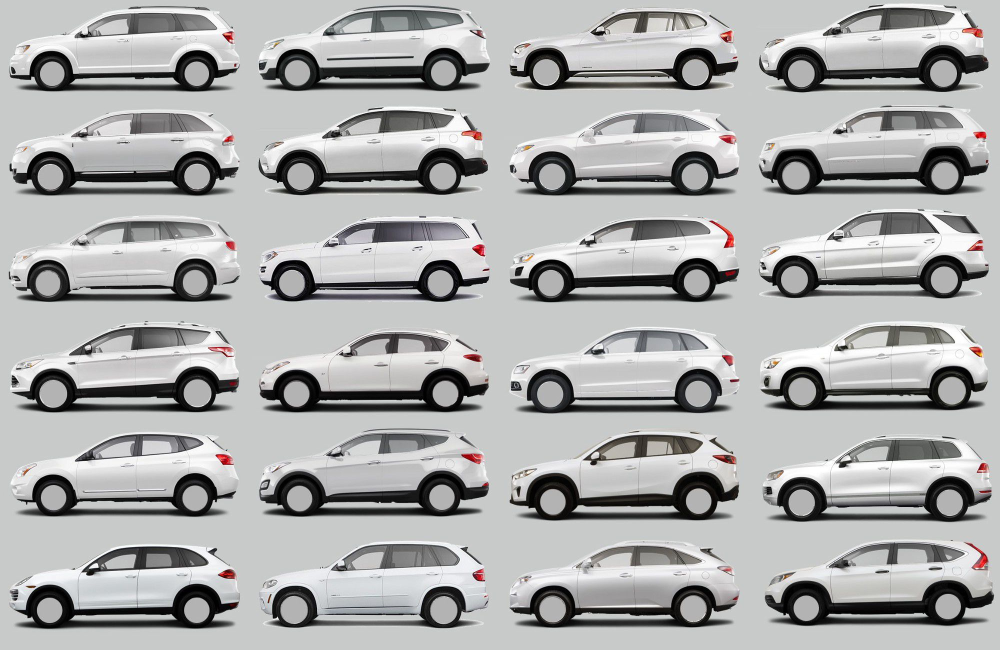

## Carbon Copy Cars

  Have you ever wondered why modern cars all look so similar? Back in the 1900s you would find all sorts of wacky and interesting car designs, so much so that some brands were defined by the cars they had. Now, all cars look pretty similar and are classified into groups like trucks, SUVs, Mini-vans, etc. Why is it like this? Why are cars classified into different groups? As it turns out, designs have gotten more homogenous due to a set of common interests that car manufacturers aim for. Whether that be better fuel efficiency or for safety, car designers follow a set of common principles for what is considered best car design. In the same way, when creating a project, programmers use a set of common patterns to ensure best practices which have come to be known as design patterns.
 
 ## Things to Consider
 
   Design patterns aren’t just a way to ensure best practices but also a way to make sure all programmers have the same idea when designing a product. For example, the MVC dictates a way of programming a user-interface; however, it isn’t the only way of designing a user interface. If two programmers programmed the user-interface using different methods, it takes more time to fix the program which costs more money. Thus, design patterns exist to help streamline projects along with enforcing what is considered best practice within the industry. Despite how much help a design pattern can be, it is also important to consider that you are using the correct design pattern for your project. Much like fitting a square peg into a round hole, trying to fit a design pattern where it doesn’t belong will at best, cause a bottleneck in your program, and at worst, cause your program to be non-functional. So when picking a design pattern, it is important to consider the needs of your project.

