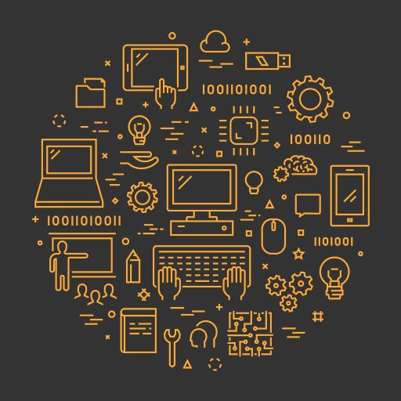

## An Uncertain Future

  Through both middle and high school, I’d always assumed I’d major in engineering. I loved building things, solving problems, and helping people. I always dreamed of having a job where I could do all of those things.. Reality hit hard as I took physics in college and hated the class. I’d come to realize that engineering was not a major I'd like to pursue. Feeling lost, I decided to branch out and take intro to computer science as a fun class to fill up some requirements. Slowly throughout the class, I’d come to make a major realization that would cause me to not only change my major but also my outlook on computer science as a whole. I’d come to realize that the concept of engineering isn’t limited to the physical world but also the digital world as well.

 
 ## In the Present
 
   My interest in computer science stems from wanting to build programs the way I envision them to be; But to be able to do that, I still have a long way to go. Thankfully, once you learn the basics of one language, all other languages come easier. In ICS 101, it takes you a whole semester to understand the ideas behind functions, classes, variables, and other basics. In 211, this was expanded upon with data structures like stacks and queues; however, once these skills are learned, they can be applied to almost every other programming language. This means that once you have the basics down, you can solve almost any problem because the tools that you learn in one language carry over to another. I’m not at the point where I can do this yet, however, polishing up my basic skills to have a strong foundation to build upon is what I aim to keep doing since computer science is an ever evolving field.

## Looking Forward

 Computers are an integral part of society but more importantly, how we interact with them is just as important as the hardware itself. I always looked up to engineering due to how problem solving skills can be used to make people's lives easier. Through computer science, I realized that I can apply this approach to programming as well. My hope is that the material I learn throughout the course will help further develop my programming skills to build more user friendly programs in the future.

